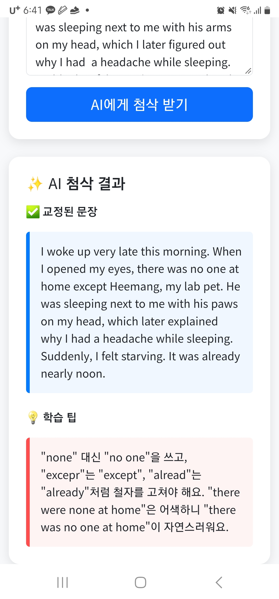
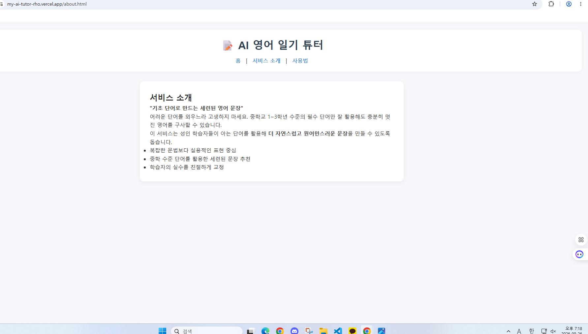

# 📝 AI 영어 일기 튜터 (AI English Diary Tutor)

AI를 활용하여 사용자가 작성한 영어 일기를 실시간으로 교정해 주고, 학습 팁을 제공하는 웹 서비스입니다.

## 🚀 배포 주소
- **Vercel URL**: https://my-ai-tutor-rho.vercel.app/index.html

## 📌 서비스 소개 (서비스 기획서)
- **서비스 목적**: 영어 작문이 막막한 학습자들을 위해 만들었습니다. 
        거창한 일기가 아니더라도, 매일의 일상을 떠올리며 <strong>딱 세 문장</strong>만 적어보세요. 
        AI의 즉각적인 피드백을 통해 틀린 부분을 바로잡고, 영작 실력을 자연스럽게 향상시킬 수 있습니다.
- **타겟 사용자**: 기초 영어 작문을 연습하는 학생 및 성인 학습자.
- **주요 기능**:
  - 영어 문장 문법 및 표현 교정
  - 교정 이유에 대한 한국어 설명(학습 팁) 제공
  - 반응형 디자인으로 모바일/PC 어디서든 이용 가능
- **페이지 구성**:
  - **홈 (Home)**: 일기 입력 및 AI 첨삭 결과 확인
  - **서비스 소개 (About)**: AI 튜터 서비스의 특징 설명
  - **사용법 (Guide)**: 서비스 이용 단계 안내

## 🛠 기술 스택
- **Frontend**: HTML5, CSS3, JavaScript (Vanilla JS)
- **Backend**: Python 3.9 (Vercel Serverless Functions)
- **AI API**: Codyssey API (gpt-5.4-mini 모델)
- **Deployment**: Vercel

## 📂 프로젝트 구조
```text
project-root/
├── api/
│   └── correction.py      # AI API 연동 백엔드 로직
├── css/
│   └── style.css          # 서비스 스타일링
├── js/
│   └── script.js          # 프론트엔드 비동기 통신 및 UI 제어
├── index.html             # 메인 페이지 (홈)
├── about.html             # 서비스 소개 페이지
├── guide.html             # 사용법 페이지
├── requirements.txt       # Python 패키지 의존성
└── README.md              # 프로젝트 문서
```
## 📸 서비스 스크린샷

### 모바일 화면


### PC 화면



### AI 코딩 대화 로그
